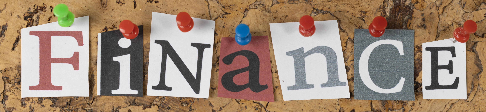

<a href="https://www.linkedin.com/in/m-awaisqasim">
  
</a>

<a href="https://x.com/AlCryp_Pk" target="_blank"></a>
<a href="https://www.linkedin.com/in/m-awaisqasim" target="_blank"></a>
<a href="https://github.com/m-awaisqasim" target="_blank"></a>

<a href="https://github.com/m-awaisqasim">
  
</a>

<h3>
  
</h3>

<a href="https://github.com/m-awaisqasim" target="_blank">
  
</a>

- 🌱 I'm currently learning **Alpha Research, Statistical Arbitrage, and Portfolio Optimization**

- 👨‍💻 My projects are available at [GitHub](https://github.com/m-awaisqasim?tab=repositories)

- 📝 I am completing BS(FinTech) at [FAST NU](https://nu.edu.pk/Program/BS%28FinTech%29)

<!-- - 💬 Ask me about **next.js, typescript, framer motion, node.js** -->

- 📫 How to reach me **[sheikhawais2566@gmail.com](mailto:sheikhawais2566@gmail.com)**

<br/>
<h3></h3>
<br/>

<p align="left">
  <a href="https://www.linkedin.com/in/m-awaisqasim" target="_blank">
    
  </a>

</p>
<h3></h3>

```txt
Total Time: 32 hrs

Alpha Research         12 hrs 15 mins  ⣿⣿⣿⣿⣿⣿⣿⣿⣦⣀⣀⣀⣀⣀⣀⣀⣀⣀⣀   38.28 %
Backtesting            8 hrs 20 mins   ⣿⣿⣿⣿⣿⣶⣀⣀⣀⣀⣀⣀⣀⣀⣀⣀⣀⣀⣀   26.04 %
C++ & Python           5 hrs 10 mins   ⣿⣿⣿⣤⣀⣀⣀⣀⣀⣀⣀⣀⣀⣀⣀⣀⣀⣀⣀   16.15 %
Risk Modeling          3 hrs 45 mins   ⣿⣷⣀⣀⣀⣀⣀⣀⣀⣀⣀⣀⣀⣀⣀⣀⣀⣀⣀   11.72 %
Futures & Derivatives  2 hrs 30 mins   ⣿⣦⣀⣀⣀⣀⣀⣀⣀⣀⣀⣀⣀⣀⣀⣀⣀⣀⣀   07.81 %
```
<br/>

<h3></h3>

> Open to quant research internships and collaborations in systematic trading and portfolio analytics.
<br/>
